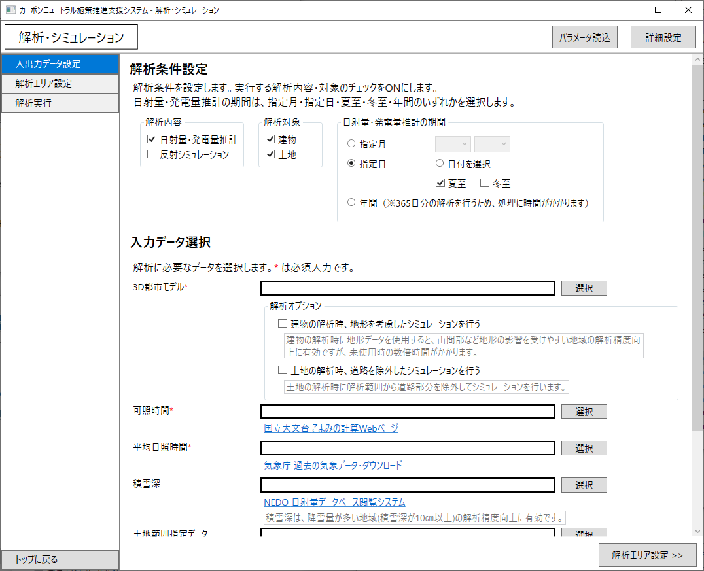

# 「カーボンニュートラル施策推進支援システムの開発」の成果物
### SolarPotential

## 1.概要
PLATEAUの3D都市モデルを活用し、太陽光発電ポテンシャル推計・反射シミュレーション及び対象施設・エリアの適地判定を行うためのシステムです。

## 2.「カーボンニュートラル施策推進支援システムの開発」について
令和6年度の3D都市モデルを活用した社会的課題解決型ユースケース開発業務「カーボンニュートラル施策推進支援システム」では、脱炭素施策推進のためのロードマップや計画策定、太陽光発電促進の重点エリア、将来の土地利用のあり方の検討などを支援し、地域の脱炭素政策の推進するため本システムを開発しました。  
本システムは、行政職員向けのGUIを備えたオープンソースソフトウェアとしてフルスクラッチで開発されています。  
太陽光発電ポテンシャルの推計及び推計結果の建物屋根面や土地面への重畳、反射シミュレーションと光害発生時間推計といった解析シミュレーション機能に加えて、発電ポテンシャルの集計機能、建物構造や災害リスク等の条件に応じた太陽光パネルの適地判定機能を実装しています。  
詳細は[技術検証レポート](https://www.mlit.go.jp/plateau/file/libraries/doc/plateau_tech_doc_0030_ver01.pdf)を参照してください。

## 3.利用手順
本システムの構築手順及び利用手順は[利用チュートリアル](https://project-plateau.github.io/SolarPotential/index.html)を参照してください。 
環境構築手順書を参照の上、ソフトウェアのインストール及びセットアップを完了させてください。 
なお、ソフトウェアにアプリケーション（実行ファイル：exe）が含まれますのでダウンロード後に、実行することが可能です。

## 4.システム概要
#### 【解析・シミュレーション】
##### 日射量推計機能
建物や土地ごとの指定した解析期間（夏至/冬至/指定日/指定月/年間）の日射量を推計します。推計にあたり、日射量と3D都市モデルから算出した屋根や土地の傾斜・方位角を利用し、日照率・傾斜・方位条件による補正を行います。
 

##### 発電ポテンシャル推計機能
建物や土地ごとの発電量を推計します。解析期間は日射量推計した期間と同じ期間です。JIS C 8907「太陽光発電システムの発電電力量推定方法」(2005年)を参照し、以下の式で算出します。
 
EPY=P∗HAY∗KPY∗1/GS
 
EPY：年間予測発電年量（kWh/年）、　P：設置可能システム容量（推定）(kW)、　HAY：年間予測日射量（kWh/m^2・年）、GS：標準試験条件による日射強度（kW・m^2）
 

##### 反射シミュレーション機能
建物・土地単位（パネルごと）の反射シミュレーションを実施し、周辺の建物に当たる反射光（反射点・到達点）を抽出します。アルゴリズムは近畿地方整備局に掲載されたU2076A 「太陽光発電における光害検討の簡易化手法について」(2020年)を活用します。
 

##### 光害発生時間推計機能　
建物単位の光害発生時間を集計します。指定した解析期間に応じて夏至、冬至、春分、指定日の1時間ごとに太陽光発電パネルに太陽光が入射する場合の反射光を計算し、他の建物に当たるか判定し、反射光が他の建物に到達した時刻を抽出し、時刻数の総和を光害発生時間とします。

#### 【適地判定・集計】
##### 集計機能
選択した範囲（エリア）内の建物を集計します。 
##### パネル設置適地判定機能
選択した範囲（エリア）において、重畳データ読み込み機能で読み込んだ各データ項目の値を集計し、予め設定した判断条件（災害リスク・パネル設置基準）と比較し、条件に該当する建物と土地を抽出します。

## 5.利用技術
|項目|内容|
|---|---|
|VisualStudio2019 C#|UIの開発に利用するプラットフォーム及び言語|
|VisualStudio2019 C++|UI以外の計算処理等の機能開発に利用するプラットフォーム及び言語|
|[shapelib](https://github.com/OSGeo/shapelib)|シェープファイルの読み込みに利用するライブラリ|
|[QGIS](https://qgis.org/)|豊富なファイル形式の空間情報の参照・加工・分析等が可能なGISフリーソフトウェア|
|[OpenLayers](https://openlayers.org/)|ブラウザ上で地図データを表示・操作が可能なJavaScriptオープンソースライブラリ|
|[OpenCV 4.10](https://opencv.org/)|画像処理・画像解析を行うライブラリ|

## 6.動作環境
| 項目               | 最小動作環境                                                                                                                                                         | 推奨動作環境                            | 
| ------------------ | -------------------------------------------------------------------------------------------------------------------------------------------------------------------- | --------------------------------------- | 
| OS                 | Microsoft Windows 10 または 11 64ビット                                                                                                                              | 同左                                    | 
| CPU                | Intel Core i3以上                                                                                                                                                    | Intel Core i5以上                       | 
| メモリ             | 4GB以上                                                                                                                                                              | 8GB以上                                 | 
| ディスプレイ解像度 | 1024×768以上                                                                                                                                                        | 同左                                    | 
| ネットワーク       | 範囲選択機能を使用する場合、以下のURLを閲覧可能な環境が必要。 国土地理院　地理院地図　 http://cyberjapandata.gsi.go.jp 地図表示のため標準地図を参照します。 | 同左                                    | 

## 7.本リポジトリのフォルダ構成
|フォルダ名|詳細|
|---|---|
|AggregateData|パネル設置適地判定のデータ管理|
|AnalyzeData|解析・シミュレーションのデータ管理|
|Analyzer|解析・シミュレーションの処理|
|JudgeSuitablePlace|パネル設置適地判定の処理|
|CommonUtil|SHPやGeoTIFFのデータ処理やファイル操作|
|SolarPotential|GUI|

## 8.ライセンス

- ソースコードおよび関連ドキュメントの著作権は国土交通省に帰属します。
- 本ドキュメントは[Project PLATEAUのサイトポリシー](https://www.mlit.go.jp/plateau/site-policy/)（CCBY4.0および政府標準利用規約2.0）に従い提供されています。

## 9.注意事項

- 本リポジトリは参考資料として提供しているものです。動作保証は行っておりません。
- 予告なく変更・削除する可能性があります。
- 本リポジトリの利用により生じた損失及び損害等について、国土交通省はいかなる責任も負わないものとします。

## 10.参考資料
- 技術検証レポート: https://www.mlit.go.jp/plateau/file/libraries/doc/plateau_tech_doc_0030_ver01.pdf
- PLATEAU Webサイト Use caseページ「カーボンニュートラル推進支援システム」: https://www.mlit.go.jp/plateau/use-case/uc22-013/
