# 操作マニュアル

# 1 本書について

本書では、カーボンニュートラル施策推進支援システム(以下「本システム」という。)の操作手順について記載しています。

# 2 使い方

## 2-1 トップ画面

本システムの実行ファイル「SolarPotential.exe」を実行すると以下の画面が表示されます。

**① 解析・シミュレーション**
- 発電ポテンシャル推計や反射シミュレーション等の解析を行う画面が表示されます。

**② 適地判定・集計**
- 解析結果の集計やパネル設置適地判定を行う画面が表示されます。

**③ 前回実行した設定を使用**
- 前回実行した設定を再利用するかどうかを設定します。チェックをオンにした場合、前回の設定内容が復元されます。

**④ 平面直角座標系の設定**
- 解析を実行する範囲の座標系を指定します。

**⑤ 終了**
- アプリケーションを終了します。

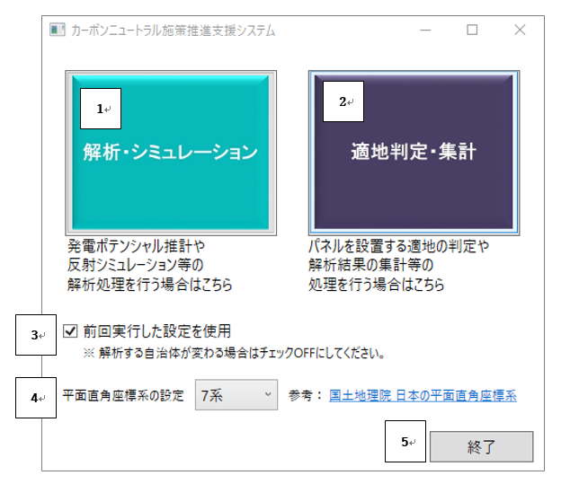

## 2-2 解析・シミュレーション画面

トップ画面から「解析・シミュレーション画面」をクリックすると、以下の画面が表示されます。

解析・シミュレーション画面は3画面に分かれています。各画面で、解析・シミュレーションの設定を行います。

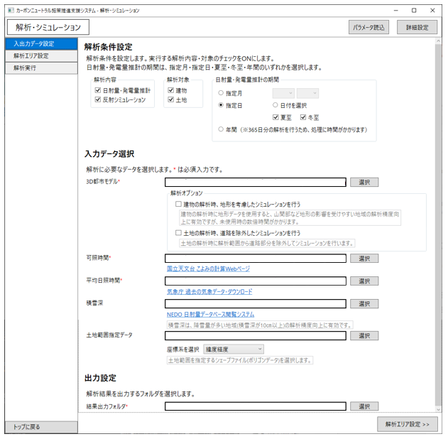

### 2-2-1 入出力データ設定

**① 解析条件設定**

解析条件を設定します。

- 解析内容
  - 日射量・発電量推計：解析する場合はチェックをオンにします。
  - 反射シミュレーション：解析する場合はチェックをオンにします。
- 解析対象
  - 建物：解析する場合はチェックをオンにします。
  - 土地：解析する場合はチェックをオンにします。
- 期間
  - 指定月：解析する月を選択します。
  - 指定日：「日付を選択」または「夏至」「冬至」から解析する日付を選択します。夏至と冬至は同時実行が可能です。
  - 年間：365日の解析を行います。解析する年は可照時間データから決定されます。

**② 入力データ選択**

本システムでは以下のサンプルデータの利用が可能です。

|     | データ名           | 入手先 |
| --- | ------------------ | ------ |
| 1  | 3D都市モデル       | CityGML |
| 2  | 可照時間           | 国立天文台(こよみの計算Webページ) |
| 3  | 平均日照時間       | 気象庁(過去の気象データ・ダウンロード) |
| 4  | 積雪深             | NEDO(国立研究開発法人 新エネルギー・産業技術総合開発機構) |
| 5  | 土地範囲指定データ |  |

1. 3D都市モデル
- G空間情報センターから入手したCityGMLフォルダ（3D都市モデル標準製品仕様書 第4.X版）を指定します。
- ※3D都市モデル標準製品仕様書 第3.X版に準拠したCityGMLファイルを利用する場合は、実行ファイル配下のファイル（SolarPotentialExe\Assets\CityGMLNameSpaces.txt）をテキストエディタで開き、赤字で示す名前空間のパスの末尾を'/3.1'から'/3.0'に編集してください。

- 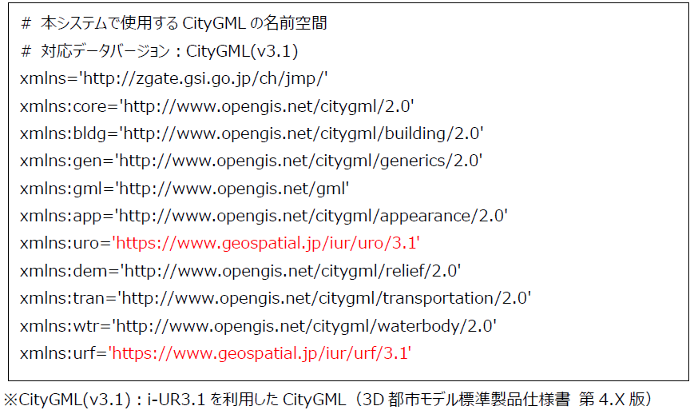

2. 可照時間
- 国立天文台のウェブサイト(こよみの計算Webページ)から取得した可照時間のCSVファイルを指定します。

3. 平均日照時間
- 気象庁のウェブサイト(過去の気象データ・ダウンロード)から取得した平均日照時間のCSVファイルを指定します。

4. 積雪深【オプション機能】
- NEDO(国立研究開発法人 新エネルギー・産業技術総合開発機構)のウェブサイト(日射量データベース閲覧システム)から取得したCSVファイルを指定します。

5. 土地範囲指定データ【オプション機能】
- 解析したい土地形状のポリゴンデータ(シェープファイル)を指定します。

**③ 出力設定**

解析結果の出力先を指定します。

**④ 入力完了**

入力が完了したら、「解析エリア設定＞＞」から解析エリア設定画面に移動します。

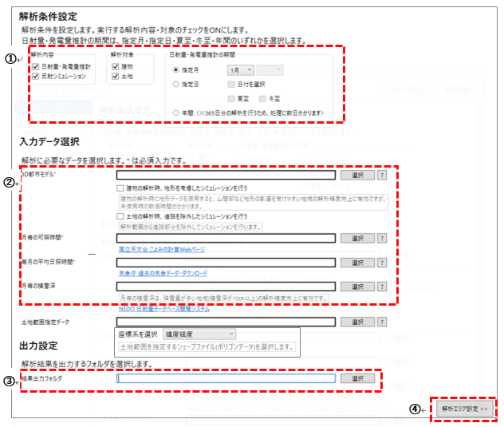

### 2-2-2 解析エリア選択

解析を行うエリアを設定します。

【注意】インターネット未接続の場合、以下の点にご注意ください。
- 地図が表示されません。
- 建物解析する場合：入力したCityGMLの全LOD2を対象として解析します。
- 土地解析する場合：土地範囲指定データを選択して解析します(解析範囲を地図上から任意に指定することができません。)

**⑤ 地図を表示**

「地図を表示」ボタンをクリックすると、3D都市モデルが存在する範囲の地図が表示されます。

**⑥ 解析エリアを指定**

地図画面上で解析する範囲を指定します。

- 地図画面内の「□」や「△」のアイコンをクリックすると、作図モードに切り替わります。
- 作図モード中に地図画面上の任意の位置をクリックし、矩形や多角形で範囲を描画します。
- 描画した図形を編集、削除する場合は、「選」アイコンをクリックして対象の図形を選択します。
  - 図形が赤線→水色線に変わると選択状態になります。
- 選択状態で、図形をマウスでドラッグすることで図形の移動や頂点の編集ができます。また、「消」アイコンをクリックすると、選択中の図形が削除されます。

**⑦ 選択エリア一覧**

指定したエリアが一覧で表示されます。

**⑧ エリアごとの設定**

選択したエリアごとの設定を行います。

各項目の設定内容は以下のとおりです。

| 項目                       | 設定内容 |
| -------------------------- | ----- |
| 除外                       | 解析対象から除外する場合、チェックをオンにします。 |
| ID                         | システムによる自動付与されます。(変更不可) |
| 名称                       | 選択したエリアに対し、任意の名称を入力します。 |
| 土地のパネル設置方位       | 【土地解析用】設置するパネルの方位を、「南向き」、「北向き」、「東向き」、「西向き」から選択します。 |
| 土地のパネル設置傾き(度)   | 【土地解析用】設置するパネルの傾斜を指定します。 |
| 水面                       | 選択したエリアを水面として解析する場合、チェックをオンにします。 |
| 説明                       | ユーザが任意の説明(コメント)を記載する事ができます。 |

**⑨ 解析エリア選択完了**

解析エリアの選択が完了したら、「確認画面＞＞」から確認画面(解析実行画面)に移動します。

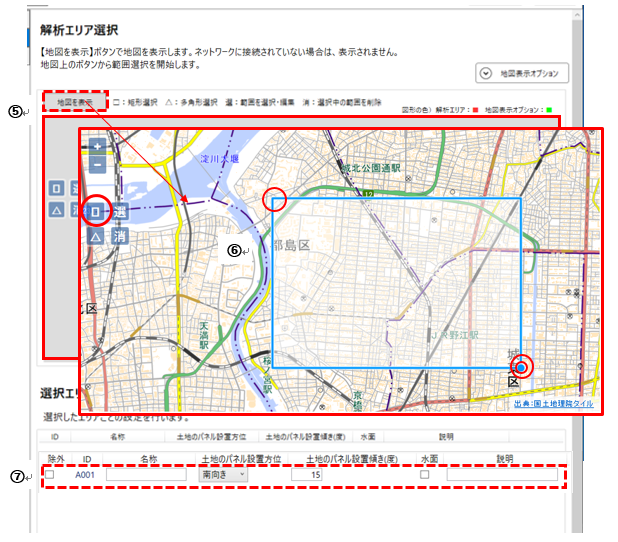
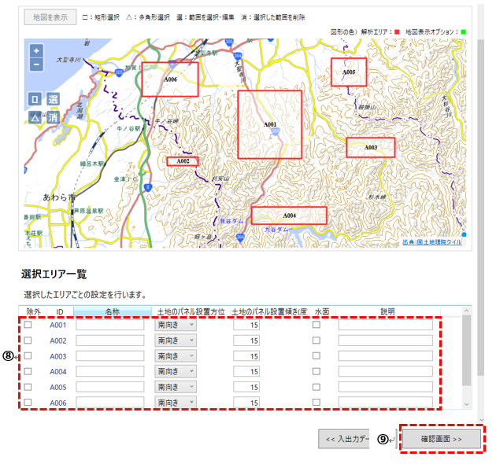

【地図表示オプション】について
- 解析エリアを選択する際の補助情報を表示する機能です。
- ユーザー指定データにはシェープファイルが指定できます。チェックをONにしたデータを地図上に表示します。

### 2-2-3 解析実行

**⑩ 解析設定の確認**

解析設定や入力データなど、入力した内容の確認画面が表示されます。

**⑪ 実行開始**

「実行開始」ボタンから、解析処理を実行します。

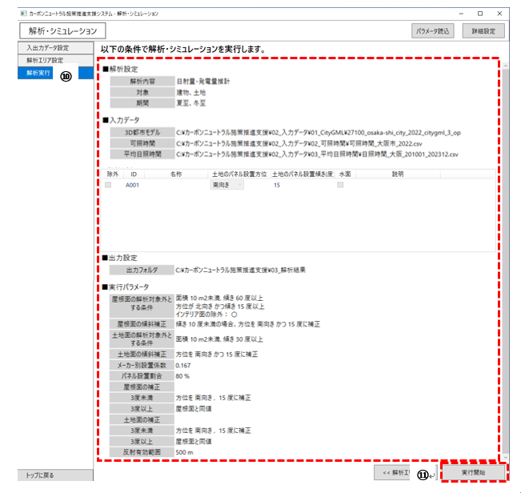

### 2-2-4 解析・シミュレーションの詳細設定【オプション機能】

解析・シミュレーションで使用する条件を変更することができます。

#### 発電ポテンシャル推計条件

① 解析・シミュレーション画面上にある「詳細設定」ボタンを選択します。

② 「発電ポテンシャル推計条件」を選択します。

③ 屋根面の解析条件を指定します。
- 解析の対象外とする屋根面の設定
  - 解析の対象外とする面積、傾き、方位と傾きを設定します。
- インテリア面を除外するかどうかを設定します。
- 屋根面の傾斜補正
  - 指定した傾斜角未満の屋根面を、指定した方位と傾斜角に補正します。

④ 土地面の解析条件を指定します。
- 解析の対象外とする土地面の設定
  - 解析の対象外とする土地の面積、傾き、方位を設定します。
- 土地面の傾斜補正
  - 土地面に設置するパネルを、指定した方位と傾斜角に補正します。(解析エリア選択画面の設定内容が優先されます。)

⑤ その他の条件を指定します。
- 太陽光パネル単位面積当たりの発電容量
  - 設置するパネルメーカー別の設置係数を設定します。(※1)
- パネル設置割合
  - パネル設置可能な面に対して、太陽光パネルを設置する割合を設定します。

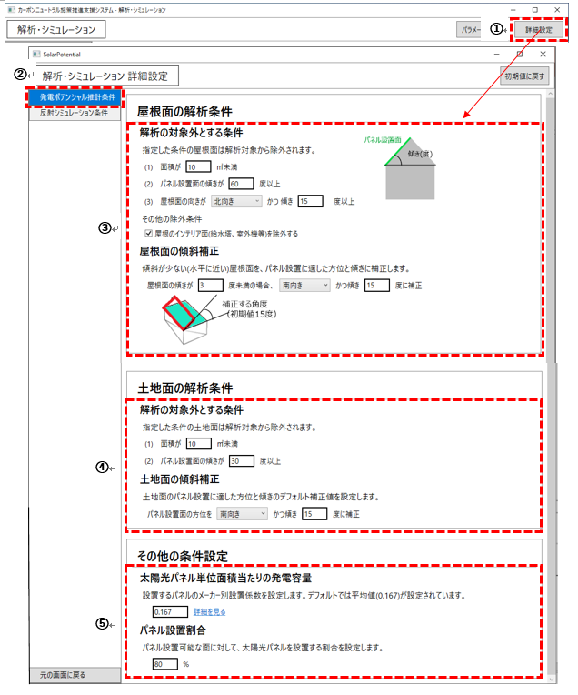

(※1)【参考】メーカー毎の太陽光パネル単位面積当たりの発電容量

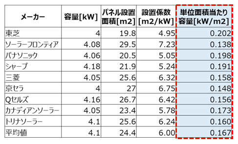

出典：環境省, [平成30年度再生可能エネルギーに関するゾーニング基礎情報等の整備・公開等に関する委託業務の報告書](https://www.env.go.jp/earth/report/30_1.html)

#### 反射シミュレーション条件

① 解析・シミュレーション画面上にある「詳細設定」ボタンを選択します。

② 「反射シミュレーション条件」を選択します。

③ 屋根面の解析条件を指定します。
- 太陽光パネル面の向き・傾きの補正条件を設定します。
  - 設定した方位・傾きに太陽光パネルを設置し、反射シミュレーションを行います。
  - 「屋根面と同値」を選択した場合は屋根面に沿って設置、「指定」を選択した場合は指定した方位と傾きに設置します。

④ 土地面の解析条件を指定します。
- 太陽光パネル面の向き・傾きの補正条件を設定します。
  - 設定した方位・傾きに太陽光パネルを設置し、反射シミュレーションを行います。
  - 「土地面と同値」を選択した場合は土地面に沿って設置、「指定」を選択した場合は指定した方位と傾きに設置します。

⑤ その他の条件を指定します。
- 反射有効範囲
  - 反射光が到達する最大距離を設定します。

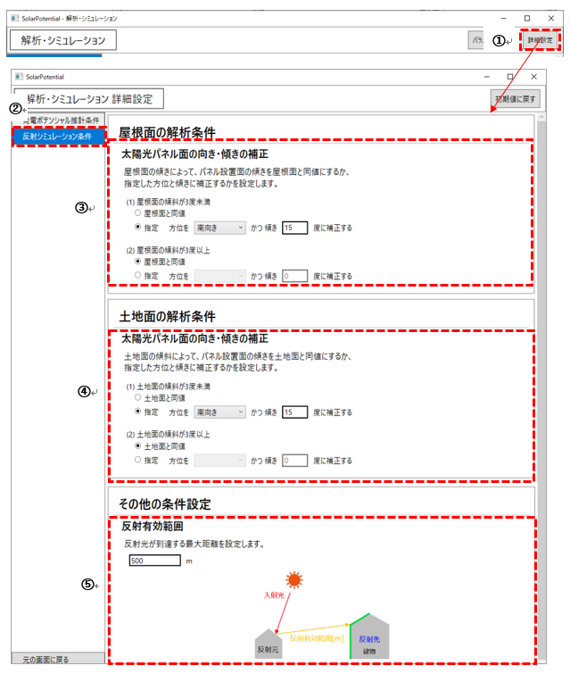

## 2-3 集計・適地判定画面

トップ画面から「適地判定・集計画面」をクリックすると、以下の画面が表示されます。

適地判定・集計画面は、3画面に分かれています。各画面で、適地判定・集計の設定を行います。

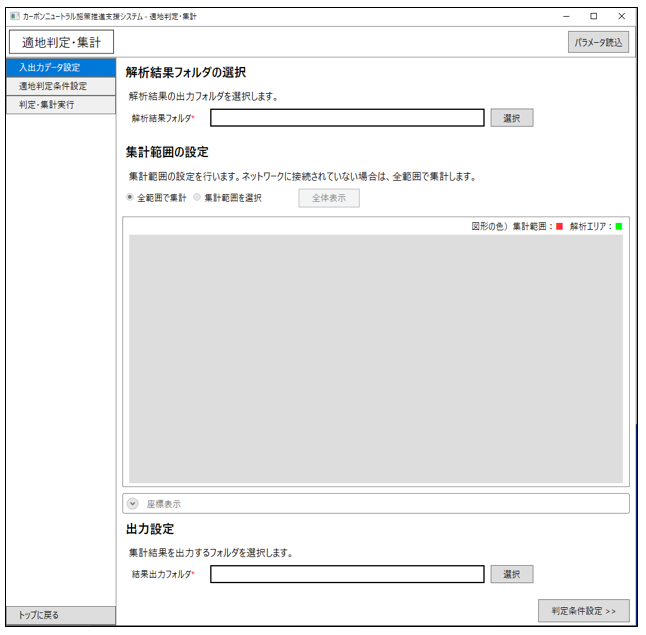

### 2-3-1 入出力データ設定

【注意】インターネット未接続の場合
- 地図が表示されません。
- 全範囲を対象として集計します(集計範囲を地図上から任意に指定することができません。)

**① 解析結果フォルダの選択**

解析・シミュレーション結果フォルダを選択します。(例：解析_202501220927)

**② 集計範囲の設定**

集計する範囲を指定します。
- 全範囲で集計
  - 解析結果の全範囲で集計します。
- 集計範囲を選択
  - 集計範囲を指定します。
- 全体表示
  - 解析・シミュレーション結果の範囲全体を表示します。

**③ 集計範囲を選択**

「集計範囲を選択」を選択した場合、地図上で集計エリアを指定(作図)します。

地図画面上で対角の2点をクリックし、矩形範囲を指定します。

**④ 出力設定**

適地判定・集計結果の出力先を指定します。

**⑤ 入力完了**

入力が完了したら、「判定条件設定＞＞」から判定条件設定画面に移動します。

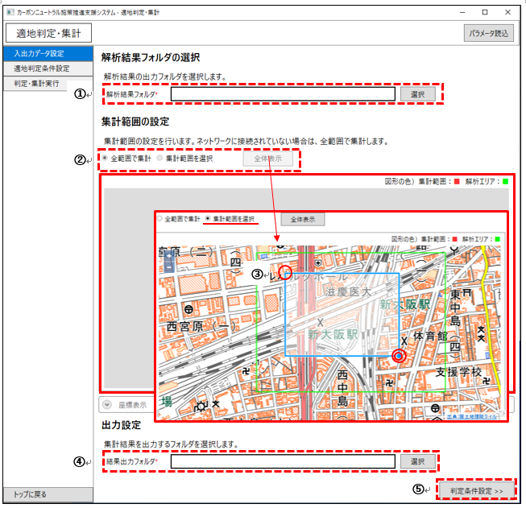

### 2-3-2 適地判定条件設定

**⑥ 太陽光パネルの設置優先度が低い建物・土地の除外条件**
- 日射量が少ない建物を除外する/除外しないを選択します。
  - 指定した日射量未満を除外：日射量の推計結果から指定した日射量未満の建物を除外します。
  - 指定した割合で除外：日射量の推計結果から指定した割合で建物を除外します。

- 建物構造による除外
  - 構造上設置が困難な可能性がある建物を除外する/除外しないを選択します。
  - 3D都市モデルの構造種別属性を用いて判定します。

- 特定の階数の建物を除外
  - 指定した階数範囲の建物を除外します。
  - 3D都市モデルの建物地上階数の属性を用いて判定します。

**⑦ 災害時に太陽光パネルが破損、消失する危険性のある建物・土地の除外条件**
- 災害リスクによる除外条件、積雪による除外条件を設定します。

**⑧ 太陽光パネルの設置に制限がある範囲の設定**
- 景観整備地区など、地方公共団体独自のパネル設置制限がある区域の情報を設定します。

**⑨ 入力完了**

入力が完了したら、「確認画面＞＞」から確認画面に移動します。

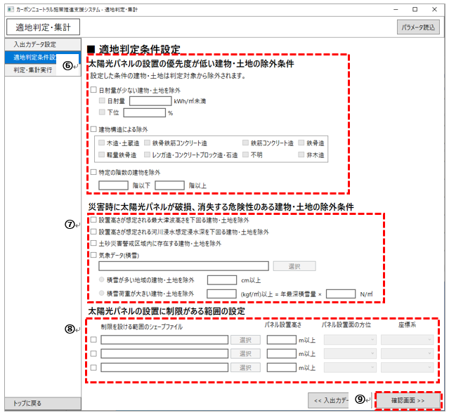

### 2-3-3 適地判定・集計実行

**⑩ 設定確認**

入力データや適地判定条件設定など、入力内容の確認画面が表示されます。

**⑪ 実行開始**

「実行開始」ボタンから、適地判定・集計処理を実行します。

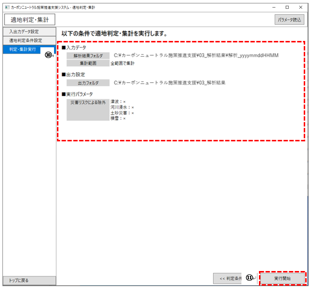

## 2-4 パラメータ読込

過去に実行した処理のパラメータファイルを読み込み、同条件でのシミュレーションや一部の条件を変更したシミュレーションを行うことができます。

① 各機能の画面上にある、「パラメータ読込」ボタンを選択します。

② パラメータの読み込み方法を選択します。
- ファイルを指定して読み込む
  - 過去に実行した結果フォルダ内などにある、パラメータファイルを指定します。
  - 「選択」ボタンからパラメータファイル(.param)を指定します。

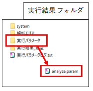

- 実行履歴を指定して読み込む
  - 実行日時や解析対象などの履歴一覧から利用するパラメータを選択します。
  - 「説明」欄には、任意のメモを記入できます。

③「読み込み」ボタンを選択し、パラメータファイルを読み込みます。
- 読み込み完了後、元の画面に戻ります。読み込んだパラメータが画面に反映されます。

# 3 出力データ

## 3-1 解析・シミュレーション機能

|    | データ種別 | 形式 | 出力内容 |
|----| ---------- | --- | --- | --- |
| 1  | CityGML | CityGML | 入力したCityGMLに予測日射量、予測発電量、夏至・春分・冬至・指定日の光害発生時間を属性として付与したデータ。 |
| 2  | 日照量のテクスチャ | JPG | 屋根面ごとの予測日射量色分け画像。 CityGMLと合わせて読み込むことでPLATEAU VIEWで屋根面ごとの単位面積当たりの予測日射量を表示する。 |
| 3  | 建物毎予測発電量 | CSV | 建物ごとの予測日射量、予測発電量、屋根面面積、PV設置面積を記載したデータ。 |
| 4  | 土地毎予測発電量 | CSV | 土地ごとの予測日射量、予測発電量、土地面面積、PV設置面積を記載したデータ。 |
| 5  | メッシュ毎予測発電量 | CSV | 土地メッシュごとの予測日射量、予測発電量、PV設置面積を記載したデータ。 |
| 6  | 単位面積あたりの予測日射量色分け画像 | GeoTIFF | 屋根面・土地面ごとの単位面積当たりの予測日射量で色分けした位置情報付きの画像データ。 |
| 7  | 単位面積あたりの日射量凡例画像 | JPG | 単位面積あたりの予測日射量の凡例画像データ。 |
| 8  | 単位面積あたりの予測発電量色分け画像 | GeoTIFF | 屋根面・土地面ごとの単位面積あたりの予測発電量で色分けした位置情報付きの画像データ。 |
| 9  | 単位面積あたりの発電量凡例画像 | JPG | 単位面積あたりの予測発電量の凡例画像データ。 |
| 10 | 反射シミュレーション結果 | CSV、CZML | 反射シミュレーションで解析した光線ベクトルの座標値を記載したデータ。 |
| 11 | 予測光害発生時間 | CSV | 建物毎の夏至、春分、冬至の光害発生時間を記載したデータ。 |
| 12 | 入力パラメータログ | PARAM(テキスト) | 解析・シミュレーション実行時のパラメータを記載したログファイル。 |
| 13 | 解析エリア | JPG、KML | 指定した解析対象範囲の画像ファイルとポリゴンデータ。 |

### 3-1-1 CityGML、日射量テクスチャ

本システムでは、発電ポテンシャル推計機能から算出された予測日射量と予測発電量、反射シミュレーション機能から算出された夏至、春分、冬至、指定日の予測公害発生時間の計5項目がLOD2の建築物モデルに属性として付与されます。

出力されるCityGMLは、LOD2の屋根面ごとに解析結果の日射量のテクスチャが割り当てられます。

### 3-1-2 建物ごと予測発電量

発電ポテンシャル推計機能により算出された建物全体の予測日射量、単位面積当たりの予測日射量、建物全体の予測発電量、単位面積当たりの予測発電量が、入力した解析エリアID、CityGMLの3次メッシュID、建物IDに紐づいてCSV形式で出力されます。

あわせて、「屋根面メッシュ抽出」で抽出されたパネル設置面積及び建物中心の座標(X,Y,Z)も出力されます。

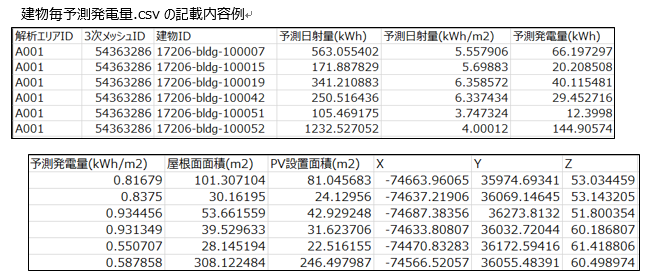

### 3-1-3 土地ごと予測発電量

発電ポテンシャル推計機能により算出された土地全体の予測日射量、単位面積当たりの予測日射量、土地全体の予測発電量、単位面積当たりの予測発電量が、入力した解析エリアIDに紐づいてCSV形式で出力されます。

あわせて、「土地面メッシュ抽出」で抽出されたパネル設置面積及び土地面中心の座標(X,Y,Z)も出力されます。

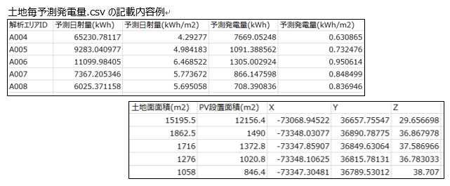

### 3-1-4 メッシュごと予測発電量

発電ポテンシャル推計機能により算出された単位面積当たりの予測日射量、単位面積当たりの予測発電量が、入力した解析エリアID、土地面メッシュIDに紐づいてCSV形式で出力されます。

あわせて、メッシュの中心座標(X,Y)も出力されます。

### 3-1-5 単位面積当たりの予測日射量による色分け画像、凡例画像

発電ポテンシャル推計機能により算出された単位面積当たりの予測日射量は、建物は3次メッシュ単位、土地は選択範囲のGeoTIFFで出力されます。

画像ファイルに位置情報が付与されているため、GISソフト(QGISやArcGIS等)で利用可能です。

色の閾値は、外部ファイル「colorSetting_SolarRad.txt」から変更可能となっています。

解析期間ごとにファイルが分かれていますので、期間に合わせて変更してください。

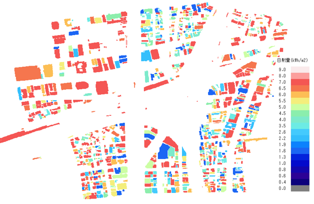

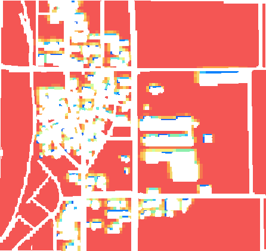

### 3-1-6 単位面積当たりの予測発電量による色分け画像、凡例画像

発電ポテンシャル推計機能により算出された単位面積当たりの予測発電量は、建物は3次メッシュ単位、土地は選択範囲のGeoTIFFで出力されます。

画像ファイルに位置情報が付与されているため、GISソフト(QGISやArcGIS等)で利用可能です。

色の閾値は、外部ファイル「colorSetting_SolarPower.txt」において変更が可能となっています。

解析期間ごとにファイルが分かれていますので、期間に合わせて変更してください。

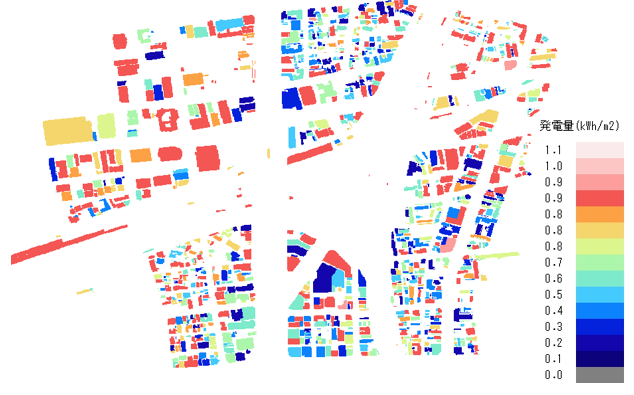

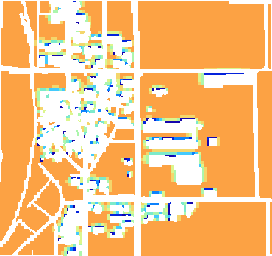

### 3-1-7 反射シミュレーション結果

反射シミュレーション機能のシミュレーション結果は、反射元の建物や土地ID、反射元の屋根面ID、シミュレーション実施日時、反射点の座標(X,Y,Z)、反射先の座標(X,Y,Z)、反射先の建物IDが、解析期間に基づいた夏至、春分、冬至、指定日のいずれか、またはすべての時点についてCSVファイルとCZMLファイルに出力されます。

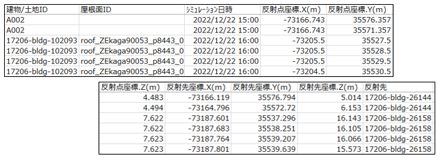

### 3-1-8 予測光害発生時間

反射シミュレーション機能により算出された予測光害発生時間は、入力したCityGMLの3次メッシュID、建物IDに紐づけられて、解析期間に基づいた夏至、春分、冬至、指定日のいずれか、またはすべての時点についてCSVファイルに出力されます。

### 3-1-9 解析エリアデータ【JPG、KML】

「解析・シミュレーション」機能によりシミュレーションを行った範囲は、画像(JPG形式)とKMLで出力されます。

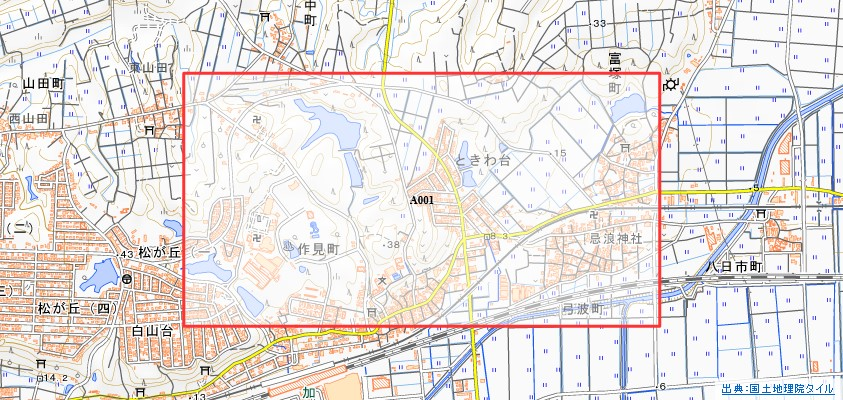

## 3-2 集計・適地判定機能

|    | データ種別 | 形式 | 出力内容 |
|----| ---------- | --- | --- | --- |
| 1  | 建物別適地判定結果 | CSV | 指定した条件で、建物ごとの優先度の判定結果を記載したデータ。 |
| 2  | 土地別適地判定結果 | CSV | 指定した条件で、土地ごとの優先度の判定結果を記載したデータ。 |
| 3  | 適地判定色分け画像 | GeoTIFF | 建物ごとの優先度で色分けした位置情報付き画像データ。 |
| 4  | 集計結果データ | CSV | 画面UI上で選択した範囲内の予測日射量、予測発電量、反射シミュレーション結果、予測光害発生時間を集計したデータ。 |
| 5  | 入力パラメータログ | PARAM(テキスト) | 適地判定・集計実行時のパラメータを記載したログファイル。 |

### 3-2-1 建物別適地判定結果データ

「適地判定・集計」機能では、建物別適地判定結果として、建物ごとの優先度と各判定条件の該当(○)非該当(×)判定外(－)がCSVファイルで出力されます。

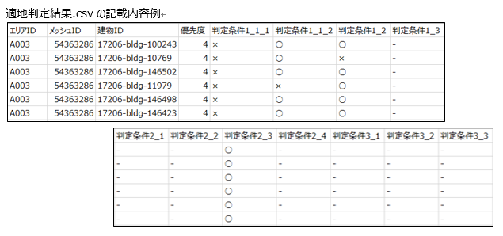

### 3-2-2 土地別適地判定結果データ

「適地判定・集計」機能では、土地別適地判定結果として、土地ごとの優先度と各判定条件の該当(○)非該当(×)判定外(－)がCSVファイルで出力されます。

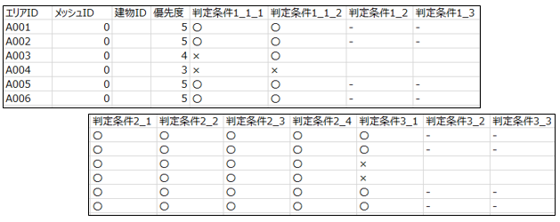

### 3-2-3 適地判定色分け画像(建物)

建物別適地判定結果は、優先度ごとに色分けされた画像がGeoTIFFで出力されます。
画像ファイルに位置情報が付与されているため、GISソフト(QGISやArcGIS等)で利用可能です。
色の閾値は、外部ファイル「ColorSetting_JudgeSuitablePlace.txt」において変更が可能となっています。

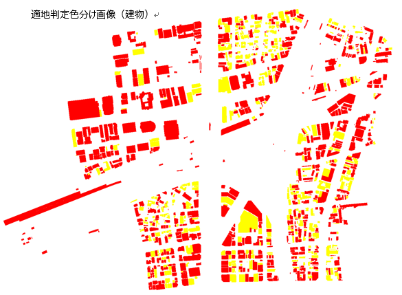

### 3-2-4 集計結果データ【CSV、JPG、KML】

「集計・適地判定」機能により算出された集計結果については、全範囲又は「集計画面の背景地図表示エリア」で選択した範囲内の結果がCSVファイルで出力されます。

CSVファイルには、範囲内建物数、予測日射量総計、予測発電量総計、光害を発生させる建物数、予測光害発生時間総計(夏至)、予測光害発生時間総計(春分)、予測光害発生時間総計(冬至)、予測光害発生時間総計(指定日)、範囲内優先度別建物数(優先度は5(高)～1(低)の5段階)が記載されます。

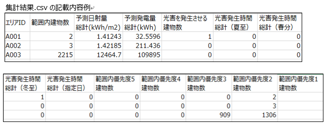

また、集計対象の範囲は、画像(JPG形式)とKMLで出力されます。

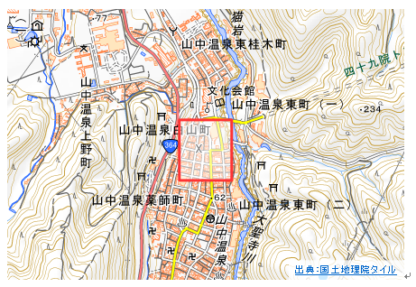

